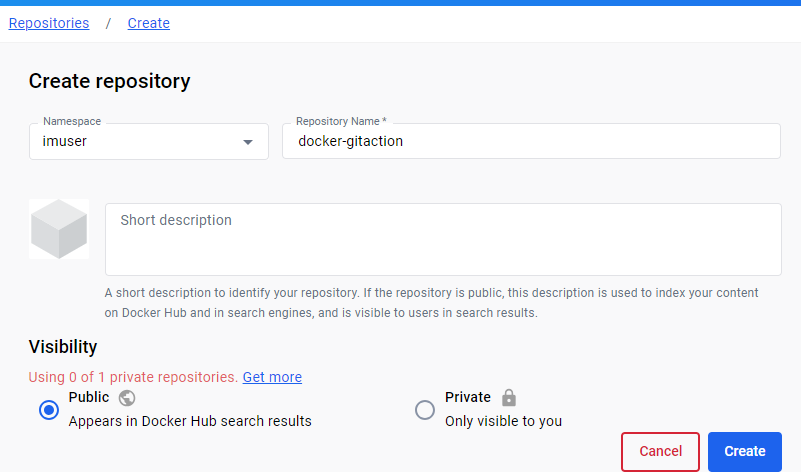

# Building a docker container via GitHub Actions

This project is about creating Docker Image using GitActions.

We will use Python and create a Flask web server that serves an `index.html` file. GitHub Actions will be used to automate the container building process, ensuring that the container is built consistently for every new commits into branch.

1. Prerequisites:

Before we begin, make sure you have the following prerequisites:

* A GitHub account
* Docker Hub account
* Setting up the Github repository
* Setting up the repository in Docker Hub



2. Create access token that will be used by Github workflow to push our docker image to Docker hub.  
“Account settings” > “Security” > “New Access Token” and provide Access Token Description.


3. Copy Paste token Go to your Github repository
“Settings" > “Secrets and variables” > “Actions” and create “New repository secret"  
**note** 
* follow naming convention for token as DOCKERHUB_TOKEN and paste value from previous step
* Create another repository secret named DOCKERHUB_USERNAME providing your Docker Hub username.


4. Create an demo file in your respository  
for eg: creating the sample python application — Flask web server  
```python
from flask import Flask, render_template

app = Flask(__name__)

@app.route('/')
def index():
    return render_template('index.html')

if __name__ == '__main__':
    app.run(host='0.0.0.0', port=5000)
```

5. Create file with name requirements.txt and the following.
```text
flask
```

6. Creating the Dockerfile
```Dockerfile
# Use the official Python 3.10 image as the base image
FROM python:3.10

# Set the working directory inside the container
WORKDIR /app

# Copy the requirements file to the working directory
COPY requirements.txt .

# Install the Python dependencies
RUN pip install --no-cache-dir -r requirements.txt

# Copy the rest of the application code to the working directory
COPY . .

# Expose the port on which the Flask app will run
EXPOSE 5000

# Specify the command to run the application
CMD [ "python", "app.py" ]
```


7. Create templates directory and file name as index.html
```html
<!DOCTYPE html>
<html>
<head>
<title>My Flask Web Server #1</title>
</head>
<body>
<h1>Welcome to My Flask Web Server!</h1>
<p>This is a sample HTML page served by Flask.</p>
</body>
</html>
```

8. Creating the GitHub Actions Workflow
In the root directory of your repository, create a directory called .github/workflows.  
Inside the .github/workflows directory, create a new file called build.yml and commit the below content.
```yaml
name: Build Docker Container

on:
  push:
    branches:
      - docker-img-gitaction 

jobs:
  docker:
    runs-on: ubuntu-latest
    steps:
      -
        name: Set up QEMU
        uses: docker/setup-qemu-action@v2
      -
        name: Set up Docker Buildx
        uses: docker/setup-buildx-action@v2
      -
        name: Login to Docker Hub
        uses: docker/login-action@v2
        with:
          username: ${{ secrets.DOCKERHUB_USERNAME }}
          password: ${{ secrets.DOCKERHUB_TOKEN }}
      -
        name: Build and push
        uses: docker/build-push-action@v4
        with:
          push: true
          tags: imuser/docker-gitaction:latest

```
**note** : make sure to verify branch name, docker credentials and docker repo name

9. Now its time to Commit this change to your repository, this should trigger automatically.

10. Navigate to the Actions tab on your repository’s page in GitHub, pipeline should be running.

11. Refresh your Docker hub, Image should be created.


12. to host Flask server, you can test by pulling the Docker Image


